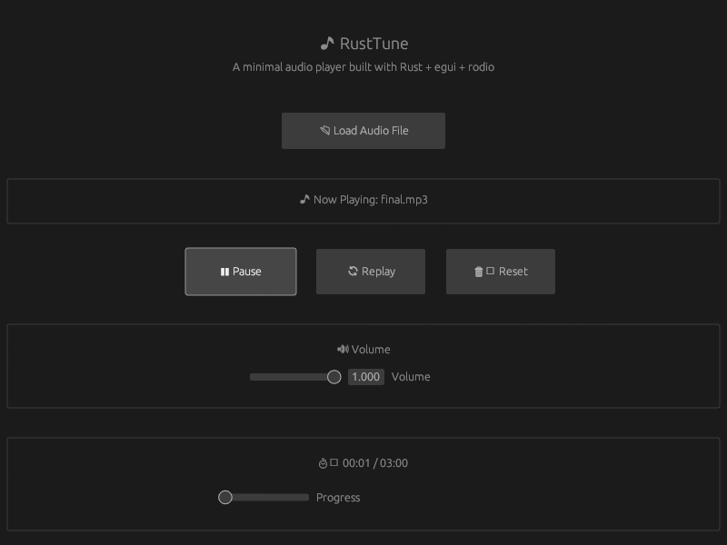

# 🎵 RustTune

A minimal yet feature-rich audio player built with Rust + egui + rodio


## 📷 Screenshots



*RustTune in action - showing the clean dark UI with centered control buttons, volume slider, and progress tracking*

## ✨ Features

- **🎶 Audio Playback** - Supports MP3 and WAV files
- **⏯️ Play/Pause Control** - Start and stop playback with ease
- **🔄 Replay Function** - Restart songs from the beginning
- **🗑️ Reset Option** - Clear current song and start fresh
- **🔊 Volume Control** - Adjustable volume slider (0-100%)
- **📊 Progress Tracking** - Real-time progress display with mm:ss format
- **🎯 Seeking** - Click and drag progress bar for instant seeking
- **🕐 Accurate Timing** - Songs stop exactly at their duration
- **🎨 Clean Dark UI** - Modern, centered interface design

## 🚀 Quick Start

### Prerequisites

- Rust 1.70+ installed
- Linux with ALSA support (for audio output)

### Installation

1. Clone the repository:
```bash
git clone <your-repo-url>
cd rusttune
```

2. Build and run:
```bash
cargo run
```

### Usage

1. **Load Audio**: Click "📂 Load Audio File" and select an MP3 or WAV file
2. **Play/Pause**: Use the "▶️ Play" / "⏸ Pause" button to control playback  
3. **Replay**: Click "🔄 Replay" to restart the current song from the beginning
4. **Reset**: Click "🗑️ Reset" to clear the current song and return to file selection
5. **Volume**: Adjust the volume slider to your preferred level
6. **Seek**: Drag the progress bar to jump to any position in the song

## 🛠️ Technical Details

### Built With

- **[Rust](https://www.rust-lang.org/)** - Systems programming language
- **[egui](https://github.com/emilk/egui)** - Immediate mode GUI framework
- **[rodio](https://github.com/RustAudio/rodio)** - Pure Rust audio playback library
- **[rfd](https://github.com/PolyMeilex/rfd)** - Native file dialog

### Architecture

- **Modular Design** - Separate `main.rs` and `player.rs` files
- **State Management** - Clean state handling with proper audio stream lifecycle
- **Error Handling** - Robust error handling for file operations and audio playback
- **Memory Safety** - Leverages Rust's ownership system for safe audio processing

### Key Improvements

✅ **Fixed Progress Bar Issues** - Accurate timing without overflow  
✅ **Instant Seeking** - Responsive progress bar dragging  
✅ **Proper Song Endings** - Songs stop exactly at their duration  
✅ **Centered UI Layout** - Professional button alignment  
✅ **Clean Code** - Optimized comments and removed compiler warnings  
✅ **Fast Audio Loading** - Efficient file handling and stream management  

## 📁 Project Structure

```
rusttune/
├── src/
│   ├── main.rs      # Application entry point
│   └── player.rs    # Audio player implementation
├── Cargo.toml       # Project dependencies
├── Cargo.lock       # Dependency lock file
└── README.md        # Project documentation
```

## 🔧 Development

### Building from Source

```bash
# Debug build
cargo build

# Release build (optimized)
cargo build --release

# Run with logging
RUST_LOG=debug cargo run
```

### Dependencies

```toml
[dependencies]
eframe = "0.27"    # GUI framework
rodio = "0.17"     # Audio playback
rfd = "0.14"       # File dialogs
```

## 🐛 Known Issues

- **ALSA Warnings**: You may see `ALSA lib pcm.c` warnings on Linux - these are harmless and don't affect functionality
- **File Format Support**: Currently supports MP3 and WAV files only

## 🤝 Contributing

Contributions are welcome! Please feel free to submit a Pull Request.

### Areas for Enhancement

- [ ] Add support for more audio formats (FLAC, OGG, etc.)
- [ ] Implement playlist functionality
- [ ] Add keyboard shortcuts
- [ ] Create shuffle and repeat modes
- [ ] Add equalizer controls

## 📄 License

This project is licensed under the MIT License - see the [LICENSE](LICENSE) file for details.

## 🙏 Acknowledgments

- Thanks to the Rust community for excellent audio libraries
- Built with love using modern Rust practices
- Inspired by the need for a simple, fast audio player

---

**Made with 🦀 Rust** | **Enjoy your music with RustTune!** 🎵
